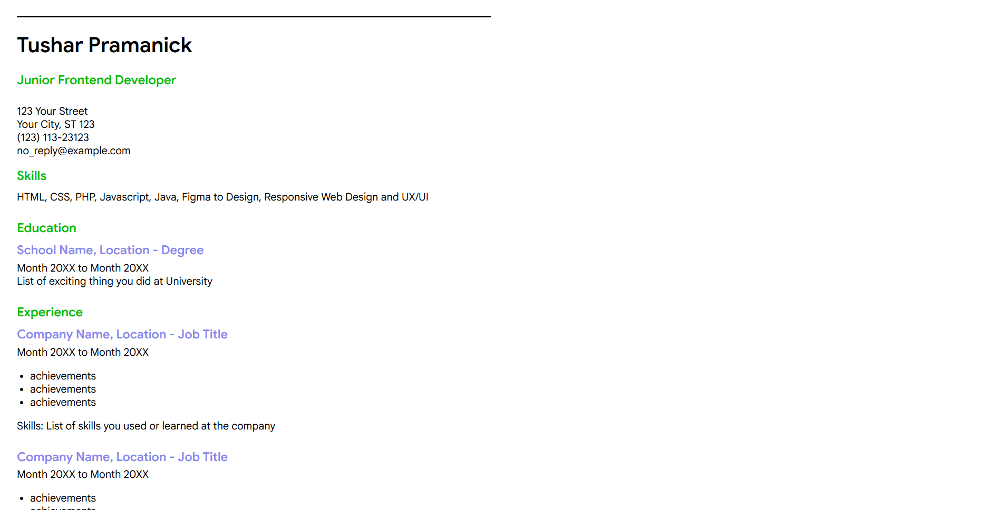
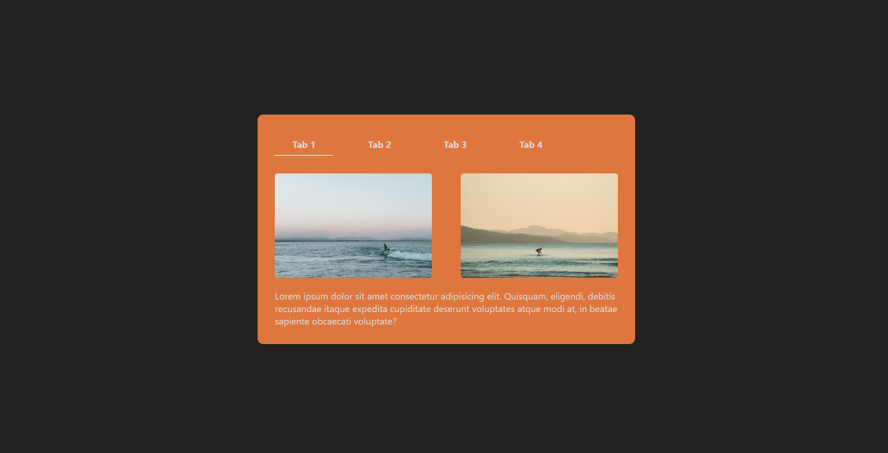
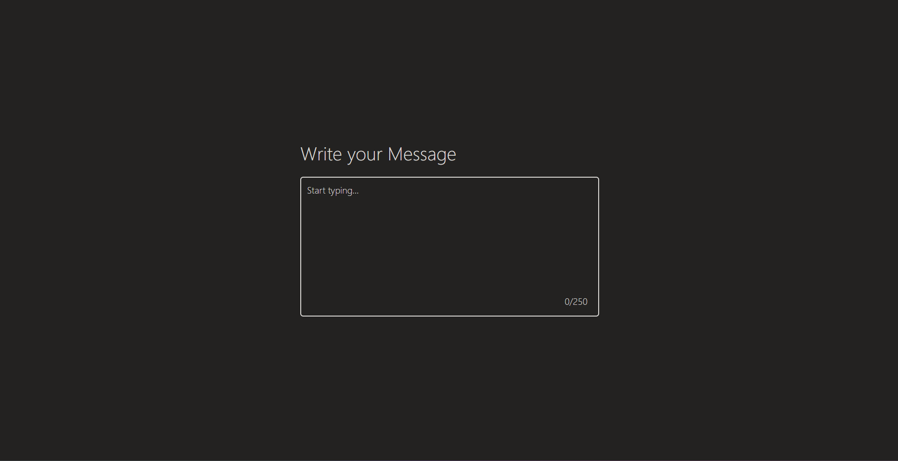
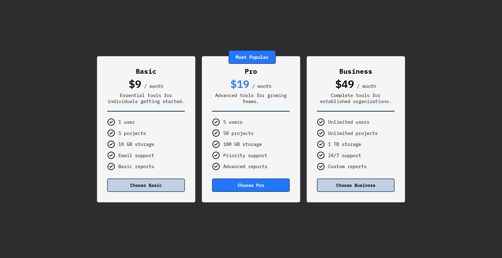

# Front-end Projects from Roadmap.sh

This repository contains front-end projects built following the [roadmap.sh](https://roadmap.sh/frontend/projects) learning path.

[single-page-cv](https://roadmap.sh/projects/single-page-cv), [simple-tabs](https://roadmap.sh/projects/simple-tabs),\
[restricted-textarea](https://roadmap.sh/projects/restricted-textarea),
[accordion-component](https://roadmap.sh/projects/accordion), [pricing-cards](https://roadmap.sh/projects/pricing-cards)

## Projects List

<table>
  <tr>
    <td align="center" valign="top" width="50%">
      
       
      <strong>Single Page CV</strong>
    </td>
    <td align="center" valign="top" width="50%">
      
       
      <strong>Simple Tabs</strong>
    </td>
  </tr>
  <tr>
    <td align="center" valign="top" width="50%">
      
       
      <strong>Restricted Textarea</strong>
    </td>
    <td align="center" valign="top" width="50%">
      
       
      <strong>Accordion Component</strong>
    </td>
  </tr>
  <tr>
    <td align="center" valign="top" width="50%">
      
       
      <strong>Pricing Cards</strong>
    </td>
    <td align="center" valign="top" width="50%">
      
       
      <strong>#</strong>
    </td>
  </tr>
</table>
